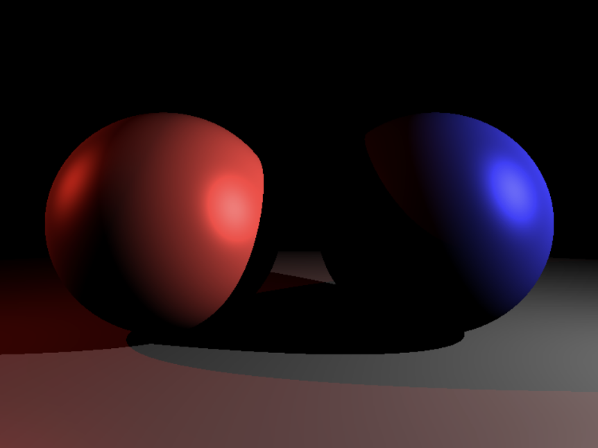
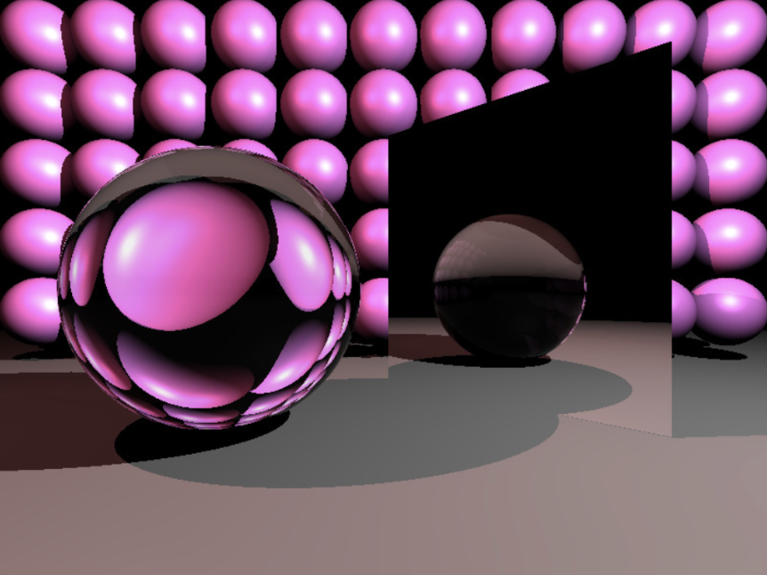
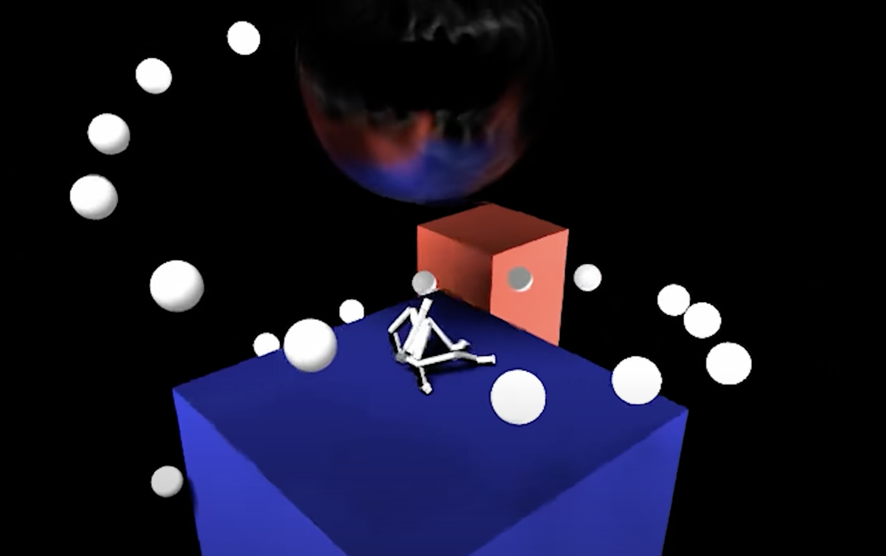

# distributed-ray-tracer

# LINK: https://youtu.be/lzIVSQKz8-w

# BUILD INSTRUCTIONS:

To compile, make sure you are in the distributed-ray-tracer folder with the Eigen folder also inside. Run `make`, which will create an executable called `previz`. Run `./previz`. The output will be `frame.0250.ppm`, a representative frame of my project. (takes ~35 seconds on my local machine and ~20 seconds on the Zoo)

  
  
  

